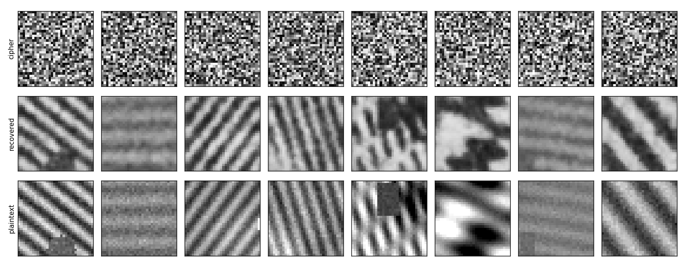
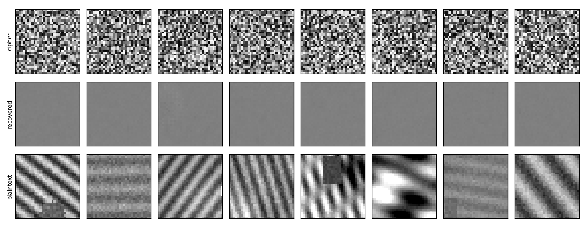
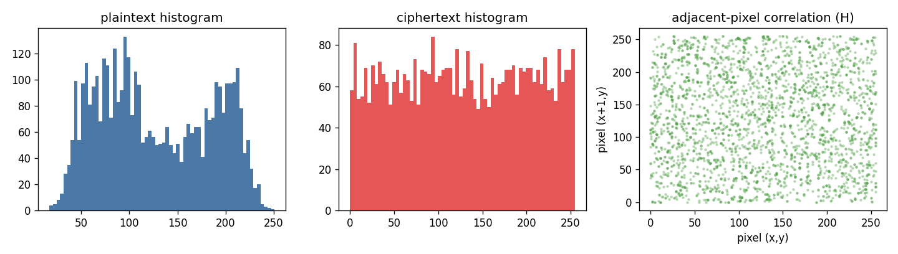

<div align="center">

# 🔓 Encrypted-Chaos

### Deep-learning cryptanalysis of chaos-based image encryption

*Can a neural network learn to read an encrypted image back — without the key?*

[](https://www.python.org/)
[](https://pytorch.org/)
[](https://fastapi.tiangolo.com/)
[](https://react.dev/)
[](https://vitejs.dev/)
[](LICENSE)


</div>

---

**Encrypted-Chaos** is the MVP for the MS/PhD thesis *"Using ML to Attack Chaos-based Image
Encryption"* (supervisor **Dr. Ayesha Khalid**). It turns a research question into a
measurable, interactive tool:

> Given thousands of *plaintext → ciphertext* image pairs from a chaos-based cipher, can a
> CNN / U-Net learn the inverse transformation and reconstruct **new** images from
> ciphertext alone — with no access to the secret key?

It does four things:

| | | |
|---|---|---|
| 🔐 **Encrypt** | Configurable chaos ciphers (logistic / 2D-logistic / Hénon maps → pixel permutation + XOR-chained diffusion, adjustable rounds & keying) plus an **AES-256-CTR** control. |
| 📊 **Profile** | The classical security metrics a reviewer expects — Shannon entropy, NPCR, UACI, adjacent-pixel correlation, histogram uniformity, key sensitivity. |
| 🧠 **Attack** | CNN / U-Net models trained on known pairs to approximate the inverse, scored by **PSNR · SSIM · MSE** against a *predict-the-mean* baseline. |
| ⚖️ **Verdict** | Reconstruction fidelity → an **Attack Risk** rating (LOW / MEDIUM / HIGH), attributed to specific cipher components through ablations. |

📄 **[RESEARCH.md](RESEARCH.md)** — thesis framing, the six research questions, hypotheses, threat model, 14-week plan.

---

## The finding, in one picture

A shallow U-Net cleanly reconstructs images encrypted with a **diffusion-only, static-key**
chaos cipher — even though that same cipher scores *textbook-perfect* on every classical
security metric.

**Weak chaos cipher — attack succeeds** &nbsp;(`cipher | recovered | plaintext`)



**Add a global pixel permutation — the same attack collapses**



| Cipher configuration | SSIM | Floor | **SSIM gain** | Attack Risk |
|---|---:|---:|---:|:---:|
| Chaos — diffusion only, static key | 0.810 | 0.055 | **+0.755** | 🔴 HIGH |
| Chaos — permutation + diffusion ×2, static key | 0.053 | 0.055 | −0.003 | 🟢 LOW |
| Chaos — permutation + diffusion ×2, per-image key | 0.052 | 0.055 | −0.003 | 🟢 LOW |
| AES-256-CTR — per-image nonce | 0.053 | 0.055 | −0.002 | 🟢 LOW |

<sub>One U-Net, identical CPU budget (14 epochs · 2 500 train / 600 test · 32×32 procedural images). Directional numbers, not final thesis figures.</sub>

Meanwhile the cipher passes every classical test — entropy **7.955**, key-sensitivity NPCR
**99.61 %** / UACI **33.47 %**, adjacent-pixel correlation **≈ 0**:



That contrast — *strong by conventional metrics, weak against a learned attack* — is the
thesis.

---

## Quick start

```bash
git clone https://github.com/ali-Hamza817/Encrypted-Chaos.git
cd Encrypted-Chaos

# ---- backend ----
python -m venv .venv && . .venv/Scripts/activate      # macOS/Linux: source .venv/bin/activate
pip install -r requirements.txt

python scripts/quickstart.py          # 60-sec end-to-end smoke test, no downloads
python scripts/run_demo_suite.py      # trains the 4 demo models (~20 min, CPU)
python scripts/serve.py               # FastAPI  ->  http://localhost:8000

# ---- frontend (new terminal) ----
cd frontend
npm install
npm run dev                           # React app  ->  http://localhost:5173
```

Open **http://localhost:5173**, press **Run the AI attack**, then toggle *Pixel shuffling*
and watch the recovery fall away.

### Verify it works

`test_images/` ships with labelled images and a
[checklist](test_images/README.md) of the exact score each should produce. Regenerate with
`python scripts/make_test_images.py`.

---

## Run the research experiments

| Command | Question |
|---|---|
| `python scripts/run_experiment.py configs/rq1_same_key.yaml` | **RQ1** — same-key known-plaintext attack (upper bound) |
| `python scripts/run_experiment.py configs/rq2_cross_key.yaml` | **RQ2** — generalization to an *unseen key* ⭐ |
| `python scripts/run_experiment.py configs/rq3_cross_algo.yaml` | **RQ3** — train on logistic, attack Hénon |
| `python scripts/run_experiment.py configs/rq4_aes_baseline.yaml` | **RQ4** — AES-CTR control |
| `python scripts/evaluate_encryption.py --map logistic --rounds 2` | Cryptographic profile of a cipher |

Each writes `experiments/<name>/` → `report.json` (config + scores), `history.json`,
`samples.png`, `model.pt`.

---

## Repository layout

```
Encrypted-Chaos/
├── chaoscrypt/            core library
│   ├── chaos.py           logistic / 2D-logistic / Hénon maps → keystream, permutation
│   ├── encryption.py      ChaosImageCipher (permute + diffuse + rounds), AESImageCipher
│   ├── crypto_metrics.py  entropy · NPCR · UACI · correlation · key sensitivity
│   ├── image_metrics.py   MSE · PSNR · SSIM
│   ├── dataset.py         procedural + torchvision sources, plaintext/ciphertext pairs
│   ├── models.py          SimpleCNN, UNet
│   ├── train.py           training loop
│   └── evaluate.py        reconstruction scoring + predict-the-mean baseline + risk
├── app/
│   ├── server.py          FastAPI backend  (/api/health · /api/analyze · /api/attack)
│   └── streamlit_app.py   alternate dashboard
├── frontend/              Vite + React + TypeScript + Tailwind + React Bits (white theme)
├── configs/               one YAML per experiment (rq1–rq4 + demo + smoke)
├── scripts/               quickstart · run_experiment · run_demo_suite · serve · make_test_images
├── test_images/           verification kit + expected-results checklist
├── web/                   self-contained shareable results page
├── RESEARCH.md            thesis framing · research questions · plan
└── tests/                 pytest — cipher round-trips & metric sanity
```

---

## Deploy

**Frontend → Vercel.** Import this repo, set **Root Directory = `frontend`** (Vite preset
is in `frontend/vercel.json`). Add env var `VITE_API_URL` = your backend origin.

**Backend → any Python host** (Render / Railway / Fly / HF Spaces) — it needs PyTorch, so
it can't run on Vercel's serverless runtime:

```
uvicorn app.server:app --host 0.0.0.0 --port $PORT
```

CORS is already open; tighten `allow_origins` to your Vercel domain for production.

---

## Reading the numbers honestly

- **"Recovery" ≠ "key broken."** The model learns an approximate *inverse transformation*,
  not the secret key. Always report the cross-key result (RQ2).
- A **static keystream** reduces to a fixed position-dependent pad any learner can
  approximate — that configuration is the known-vulnerable baseline, shown for contrast.
- Success is scored as **SSIM gain over a predict-the-mean floor**, not raw SSIM, so a
  homogeneous test set can't inflate a failed attack.
- Risk thresholds in `chaoscrypt/evaluate.py` are placeholders — calibrate per dataset.

---

## References

1. He, C., Ming, K., Wang, Y., & Wang, Z. J. (2019). *A deep learning based attack for the
   chaos-based image encryption.* arXiv:1907.12245.
2. Zhang, B., & Liu, L. (2023). *Chaos-based image encryption: review, application, and
   challenges.* Mathematics, 11(11), 2585.

---

<div align="center">
<sub>Built for a thesis supervised by Dr. Ayesha Khalid · <a href="LICENSE">MIT</a></sub>
</div>
